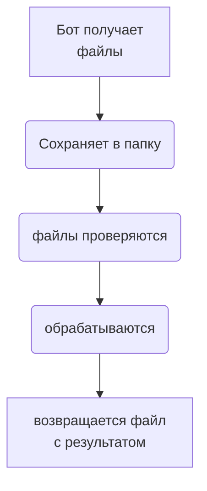

# RPA_telegram

### Create python venv
```bash
python -m venv venv && . venv/Scripts/activate
pip install -r requirements.txt 
```
### Create file .env
```bash
vim .env
```
#### add in .env TOKEN = "yor token telegram bot" 

#### training materials
[Exsample training aiogram3](https://mastergroosha.github.io/aiogram-3-guide/filters-and-middlewares/)

[Создание диаграмм github](https://habr.com/ru/articles/652867/) # Хабр

[documentations diogramms github](https://docs.github.com/ru/get-started/writing-on-github/working-with-advanced-formatting/creating-diagrams)

[documentations telegramm](https://core.telegram.org/bots/api#sending-files)


## scheme

